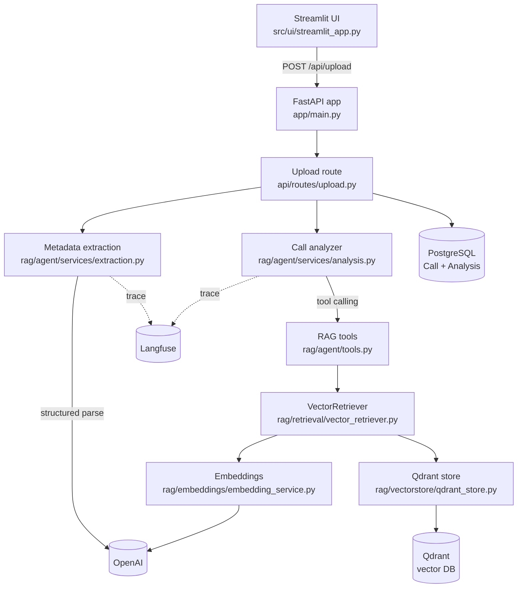

# Sales Call Debrief Agent

FastAPI + Streamlit app for analyzing sales call transcripts, returning structured coaching insights, and persisting the results with RAG-backed context.

[](https://www.python.org/)
[](https://docs.docker.com/compose/)
[](https://fastapi.tiangolo.com/)
[](https://streamlit.io/)
[](https://www.postgresql.org/)
[](https://qdrant.tech/)
[](https://langfuse.com/)

## 30-Second Snapshot

**Problem →** Sales teams lose valuable coaching insights because call reviews are manual, inconsistent, and slow.

**Method →** Built a FastAPI + Streamlit app that ingests sales transcripts, extracts deal metadata, and runs a RAG-backed AI debrief agent to generate structured coaching feedback.

**Result →** Produces immediate, repeatable call analysis (summary, strengths, objections, action items, sentiment, score) and stores results for ongoing coaching and performance tracking.

**How to run →** put an `OPENAI_API_KEY` in `.env`, then `docker compose up`. Postgres, Qdrant, migrations, knowledge-base seeding, the API and the UI all come up together — open `http://localhost:8501`. A native `uv` workflow is documented below as an alternative.

## What This Project Does

- Accepts a UTF-8 `.txt` sales transcript via `POST /api/upload`
- Extracts metadata (`rep_name`, `contact_name`, `contact_title`, `deal_stage`) with OpenAI structured parsing
- Runs a retrieval-backed debrief agent with LangChain tool calling against Qdrant
- Persists `Call` and `Analysis` records, then returns structured `AnalysisResult` fields:
  - `summary`, `next_steps`, `competitor_mentioned`
  - `strengths`, `areas_for_improvement`, `action_items`, `objections_raised`
  - `sentiment`, `score`

## Current Architecture



**Key components**

| Layer | Path |
| --- | --- |
| App entrypoint | `src/debrief_agent/app/main.py` |
| Upload route | `src/debrief_agent/api/routes/upload.py` |
| Extraction service | `src/debrief_agent/rag/agent/services/extraction.py` |
| Analysis service | `src/debrief_agent/rag/agent/services/analysis.py` |
| RAG tools | `src/debrief_agent/rag/agent/tools.py` |
| Retriever | `src/debrief_agent/rag/retrieval/vector_retriever.py` |
| Vector store | `src/debrief_agent/rag/vectorstore/qdrant_store.py` |
| Observability | `src/debrief_agent/core/observability.py` |
| Persistence | async SQLAlchemy models in `src/debrief_agent/models/` |
| UI | `src/ui/streamlit_app.py` |


## Quick Start with Docker (recommended)

The only prerequisites are Docker Desktop (or Docker Engine with the Compose
plugin) and an OpenAI API key. No local PostgreSQL, Qdrant, or Python install.

```zsh
git clone https://github.com/nstonny/sales-call-debrief-agent.git
cd sales-call-debrief-agent
echo "OPENAI_API_KEY=sk-..." > .env
docker compose up
```

Then open **`http://localhost:8501`** and upload a transcript from
`src/data/transcripts/`.

`OPENAI_API_KEY` is the only variable required. `docker-compose.yml` supplies
`DATABASE_URL` and `QDRANT_URL` itself, because inside Compose they must address
the `db` and `qdrant` services by name rather than `localhost`. Langfuse keys are
optional — tracing is simply inactive when they are unset.

### What comes up

| Service | Role | Host address |
| --- | --- | --- |
| `db` | PostgreSQL 17 | `localhost:5433` |
| `qdrant` | Vector database | `localhost:6333` |
| `migrate` | One-shot `alembic upgrade head`, then exits | — |
| `seed` | One-shot knowledge-base embedding, then exits | — |
| `api` | FastAPI | `localhost:8000` ([docs](http://localhost:8000/docs)) |
| `ui` | Streamlit | `localhost:8501` |

Startup is ordered: `db` must pass its healthcheck, then `migrate` and `seed`
must each exit successfully, and only then do `api` and `ui` start.

`db` is published on **5433**, not 5432, so the stack does not collide with a
PostgreSQL install already running on the host. Containers still reach it on
`db:5432` over the Compose network; only host-side tools such as `psql` need the
offset.

### First run

The `seed` service embeds the knowledge base into Qdrant — 155 chunks across
sales frameworks, coaching guides, and call examples. This calls the OpenAI
embeddings API once and takes roughly a minute.

Vectors live in a named volume from then on, so subsequent runs skip it:

```
seed-1  | Qdrant collection already holds 155 points -- skipping seed.
```

Seeding is guarded rather than idempotent by nature: ingestion appends with fresh
point IDs, so an unguarded re-run would duplicate every chunk instead of
replacing it. To deliberately re-embed after changing a chunker:

```zsh
docker compose run --rm seed python -m debrief_agent.rag.ingestion.seed_all --force
```

### Everyday commands

```zsh
docker compose logs -f api        # follow API logs
docker compose ps                 # service states and exit codes
docker compose down               # stop; volumes (and vectors) are preserved
docker compose down -v            # stop and delete volumes; next up re-seeds
docker compose up --build         # rebuild after a dependency change
```

`./src` is bind-mounted into `api` and `ui`, so edits to Python files reload
without a rebuild — `--build` is only needed when `pyproject.toml`, `uv.lock`, or
the `Dockerfile` change.

The Compose Postgres credentials are hardcoded development values
(`debrief`/`debrief`). This stack is a local development and demo environment,
not a deployable configuration.

## Prerequisites (native run)

Only needed if you would rather run without Docker.

- Python 3.13+
- PostgreSQL
- Qdrant (local or remote)
- OpenAI API key
- `uv`

Install `uv` if needed:

```zsh
curl -LsSf https://astral.sh/uv/install.sh | sh
```

## Installation

```zsh
git clone https://github.com/nstonny/sales-call-debrief-agent.git
cd sales-call-debrief-agent
uv venv
source .venv/bin/activate
uv sync
```

Create `.env` in repo root:

```env
DATABASE_URL=postgresql+asyncpg://<user>:<password>@localhost:5432/<db_name>
OPENAI_API_KEY=sk-...

QDRANT_URL=http://localhost:6333
QDRANT_API_KEY=
QDRANT_COLLECTION_NAME=sales_knowledge_chunks
QDRANT_TIMEOUT_SECONDS=10

# Optional
ANALYSIS_RUBRICS=overpitching_rubric.txt,discovery_rubric.txt,pricing_negotiation_rubric.txt
DEBRIEF_AGENT_MODEL=gpt-5-mini
DEBRIEF_AGENT_LOG_RAG_CHUNKS=false
```

If you use Langfuse, add its keys as well. Tracing stays inactive when they are
unset.

```env
LANGFUSE_PUBLIC_KEY=
LANGFUSE_SECRET_KEY=
LANGFUSE_BASE_URL=https://cloud.langfuse.com
```

See `.env.example` for the full annotated list.

Run migrations:

```zsh
uv run alembic upgrade head
```

## Run the App (native)

Backend API:

```zsh
uv run uvicorn debrief_agent.app.main:app --reload
```

Streamlit UI (second terminal):

```zsh
uv run streamlit run src/ui/streamlit_app.py
```

Endpoints:

- API docs: `http://localhost:8000/docs`
- UI: `http://localhost:8501`

## Testing

The project uses **pytest** (with `pytest-asyncio`, `pytest-mock`, and
`pytest-cov`). Configuration lives in `pyproject.toml` under
`[tool.pytest.ini_options]`.

Run the full suite:

```zsh
uv run pytest
```

With coverage:

```zsh
uv run pytest --cov=debrief_agent
```

The unit tests live in `tests/` and run fully offline — no OpenAI, Qdrant, or
database connection is required. External boundaries (the OpenAI client, the
embedding/Qdrant search) are stubbed or patched, so the tests exercise real
application logic in isolation. Current coverage focuses on:

- **Document chunkers** — coaching guide, PDF/markdown, and call-example
  splitters (heading detection, long-section splitting, chunk metadata)
- **Schemas** — `AnalysisResult` and `CallMetadataExtraction` (blank-string
  normalization, enum coercion, score bounds)
- **Retrieval** — `VectorRetriever` payload/metadata resolvers, point mapping,
  and knowledge-type filter merging
- **Extraction service** — `MetadataExtractor.extract` success path and the
  502 failure contract (OpenAI error, LLM refusal, invalid payload)
- **RAG tools & loaders** — knowledge-type routing and extension-based
  document loading

## API Usage

### Upload and analyze transcript

```zsh
curl -X POST "http://localhost:8000/api/upload" \
  -F "file=@src/data/transcripts/transcript_1.txt" \
  -F "company=Acme GmbH" \
  -F "deal_value=25000"
```

### Expected behavior

- Validates `.txt` + UTF-8
- Persists `Call`
- Runs extraction + analysis
- Persists `Analysis`
- Returns full `CallResponse` with nested `analysis`

## Service Usage (Internal)

```python
from debrief_agent.rag.agent.services.extraction import MetadataExtractor
from debrief_agent.rag.agent import CallAnalyzer

metadata_extractor = MetadataExtractor()
analyzer = CallAnalyzer()

transcript = "..."
metadata = await metadata_extractor.extract(transcript)
analysis = await analyzer.analyze(transcript=transcript, metadata=metadata)
```

## RAG Ingestion Commands

These CLIs import `debrief_agent.rag.ingestion.bootstrap_qdrant.ensure_collection`
and use the shared Qdrant collection from `QDRANT_COLLECTION_NAME`.

To run all three at once — which is what the Compose `seed` service does — use
`seed_all`. It skips the whole run when the collection already holds points,
because the individual CLIs append with fresh point IDs rather than replacing,
so an unguarded re-run duplicates every chunk:

```zsh
uv run python -m debrief_agent.rag.ingestion.seed_all
uv run python -m debrief_agent.rag.ingestion.seed_all --force   # drop, then re-embed
```

The individual commands below remain useful for working on one chunker at a time.

### 1) Sales frameworks markdown ingestion

Module: `src/debrief_agent/rag/ingestion/ingest_pdf_documents.py`

Reads processed markdown files from `src/data/knowledge_base/sales_frameworks`.

Dry-run:

```zsh
uv run python -m debrief_agent.rag.ingestion.ingest_pdf_documents --dry-run
```

Ingest into Qdrant:

```zsh
uv run python -m debrief_agent.rag.ingestion.ingest_pdf_documents
```

### 2) Coaching guides ingestion

Module: `src/debrief_agent/rag/ingestion/ingest_coaching_guides.py`

Dry-run:

```zsh
uv run python -m debrief_agent.rag.ingestion.ingest_coaching_guides --dry-run
```

Ingest into Qdrant:

```zsh
uv run python -m debrief_agent.rag.ingestion.ingest_coaching_guides
```

### 3) Call examples ingestion

Module: `src/debrief_agent/rag/ingestion/ingest_call_examples.py`

Dry-run:

```zsh
uv run python -m debrief_agent.rag.ingestion.ingest_call_examples --dry-run
```

Ingest into Qdrant:

```zsh
uv run python -m debrief_agent.rag.ingestion.ingest_call_examples
```

### 4) Convert PDF to markdown (MarkItDown)

Module: `src/debrief_agent/rag/scripts/document_processing/convert_pdf_to_markdown_markitdown.py`

Default paths convert `src/data/knowledge_base/company_playbooks/Sales_Playbook.pdf`
to `src/data/knowledge_base/company_playbooks/Sales_Playbook.md`.

```zsh
uv run python -m debrief_agent.rag.scripts.document_processing.convert_pdf_to_markdown_markitdown
```

## Debugging and Observability

### RAG chunk logging

To inspect retrieved chunks in the API terminal:

```zsh
export DEBRIEF_AGENT_LOG_RAG_CHUNKS=true
uv run uvicorn debrief_agent.app.main:app --reload
```

When tools are called, logs include:

- retrieval type and query
- number of returned chunks
- per chunk: score, source, preview text

### Langfuse tracing

Spans include fields like:

- `service`
- `model`
- `trace_id`
- `session_id`
- `error_type`
- `validation_ok`
- `had_refusal`

## Project Structure

```text
sales-call-debrief-agent/
├── migrations/
├── src/
│   ├── data/
│   │   ├── knowledge_base/
│   │   │   ├── call_examples/
│   │   │   ├── coaching_guides/
│   │   │   ├── company_playbooks/
│   │   │   └── sales_frameworks/
│   │   ├── transcripts/
│   │   └── ...
│   ├── debrief_agent/
│   │   ├── api/
│   │   ├── app/
│   │   ├── core/
│   │   ├── models/
│   │   ├── rag/
│   │   │   ├── agent/
│   │   │   │   ├── prompts/
│   │   │   │   ├── services/
│   │   │   │   │   ├── analysis.py
│   │   │   │   │   └── extraction.py
│   │   │   │   └── tools.py
│   │   │   ├── embeddings/
│   │   │   ├── ingestion/
│   │   │   ├── loaders/
│   │   │   ├── retrieval/
│   │   │   ├── scripts/
│   │   │   └── vectorstore/
│   │   └── schemas/
│   └── ui/
├── tests/
│   └── unit/
│       ├── agent/
│       ├── loaders/
│       ├── retrieval/
│       ├── schemas/
│       └── splitters/
├── experiments.local/
├── Dockerfile
├── docker-compose.yml
├── .dockerignore
├── .env.example
├── pyproject.toml
└── README.md
```

## Troubleshooting

- **`OPENAI_API_KEY is not set`**
  - Set it in `.env` and restart the API process.
- **`DATABASE_URL is not set`**
  - Set it in `.env`, then run migrations.
- **`POST /api/upload` returns 502**
  - Check API logs for extraction or analysis validation errors.
  - If tools are expected but not used, verify prompts under `rag/agent/prompts/analysis.py`.
- **No RAG chunk logs visible**
  - Ensure `DEBRIEF_AGENT_LOG_RAG_CHUNKS=true` in the same process running Uvicorn.
  - Ensure tools are actually called for that request.
- **`uv: command not found`**
  - Install `uv`, restart shell, verify with `uv --version`.

### Docker

- **`set OPENAI_API_KEY in .env`** on `docker compose up`
  - Compose interpolates the key from `.env` in the repo root. Create the file
    before starting; the stack refuses to launch without it rather than failing
    later inside a container.
- **`port is already allocated`**
  - Something on the host already owns 8000, 8501, 6333, or 5433. Stop it, or
    change the left-hand side of the relevant `ports:` mapping.
  - A standalone `qdrant` container from a previous native setup is the usual
    culprit on 6333: `docker stop qdrant`.
- **Agent returns no RAG context in Docker**
  - Check that seeding ran: `docker compose logs seed`. It should report either
    155 points stored or "already populated".
  - Confirm the collection is non-empty:
    `curl -s localhost:6333/collections/sales_knowledge_chunks`.
- **Code edits are not taking effect**
  - Python changes under `src/` reload automatically via the bind-mount. Changes
    to `pyproject.toml`, `uv.lock`, or the `Dockerfile` need
    `docker compose up --build`.
- **Vectors disappeared after a restart**
  - `docker compose down -v` deletes the named volumes. Plain
    `docker compose down` preserves them.
